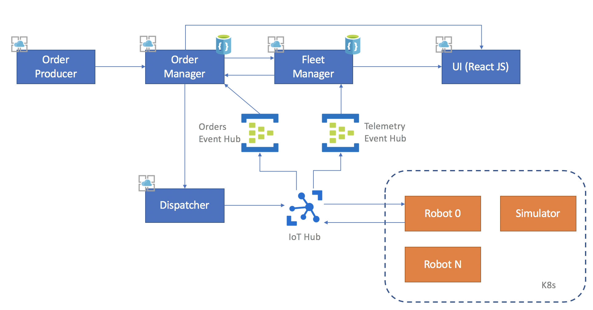
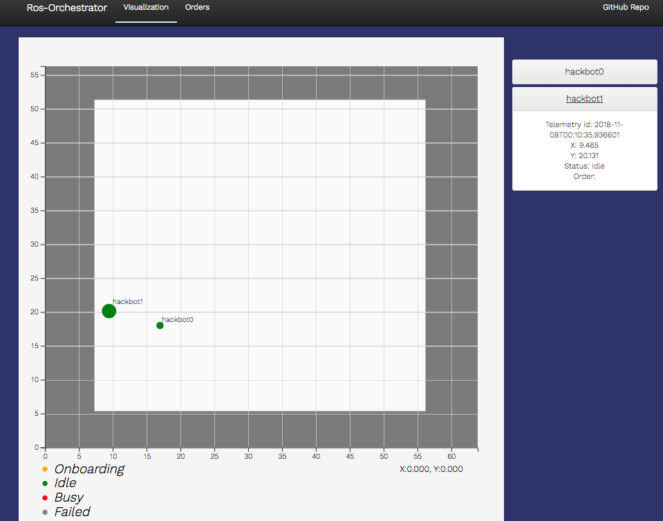
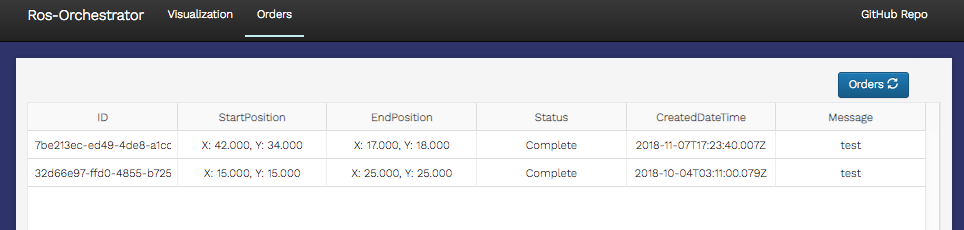

# Architecture

## Diagram

## Web APIs

There are four main microservices in the robot orchestrator project: Order Producer, Order Manager, Fleet Manager, and Dispatcher.

They are all implemented in .NET Core 2.1 and are deployed to public Azure Web Apps for our sample scenario. The state of the orchestration system is stored in Cosmos DB, which is discussed in more detail below.

### Order Producer

The Order Producer is used to simulate orders entering the orchestration system. It will create an order with a unique id and set the start and end positions to valid coordinates on the map. This order is then sent to Order Manager.

This component can be replaced with logic that pushes real orders from an SAP system, for example.

Currently, there are two ways to use the Order Producer. It is possible to send a single order, or start a stream of orders at a given interval.

See the [Send Test Orders doc](./SendTestOrders.md) for more details.

### Order Manager

Order Manager keeps track of orders flowing through the orchestration system. When new orders arrive, the order manager adds the order to Cosmos DB.

Next, the order manager tries to assign the order to an available (idle) robot. For this simple implementation, the assignment algorithm is to pick any available robot, but the assignment can be replaced with more complex logic, such as closest robot to the start position, etc.

Once the order is assigned, a job is sent to the dispatcher, who will send it along to the robot for execution.

If the assignment fails, the order is set to failed and the database is updated.

The order manager also contains an Event Processor Host which will consume events related to job updates. The job updates come from the robots to Iot Hub, to Event Hub, and then to the order manager. The Order Manager then updates the order status in the database based on the job state.

### Fleet Manager

The Fleet Manager keeps track of the robots in the orchestration system. It is responsible for robot onboarding. When the robot first comes online, it contacts the fleet manager to get a connection string for Iot Hub. The fleet manager will create the device in Iot Hub and the Cosmos DB if it does not yet exist.

The fleet manager also contains an Event Processor Host which will consume events related to telemetry updates from the robot. The telemetry flows from the robots to Iot Hub, to Event Hub, and then to the fleet manager. The fleet manager then updates the robot and telemetry collections in Cosmos DB.

### Dispatcher

The dispatcher is responsible for sending jobs to the robots. It formats the job into a Ros Message and uses Iot Hub Cloud-to-Device messages to deliver the job to the robot.

## UI

The UI is a simple visualization tool to see what is happening in the orchestrator. The UI is implemented in React JS, and is served from an Azure Web App as static content.

It has two main pages:

1. Map

    This shows the map image as well as the robot locations on the map. The robot panel has a list of all robots in the orchestration system. When the robot panel is clicked, it will pull down more information about the status and location of the robot.

1. Orders

    This displays the most recent orders that have flown into the system.

## IotHub

Iot Hub serves as the main communication mechanism between the orchestrator and the robots. Outside of onboarding, all jobs and telemetry flow through Iot Hub.

### Event Hub Routing

The robot sends Device-to-Cloud messages to Iot Hub, where they are then forwarded to various Event Hubs based on routing rules. The two routing rules used in this application are for jobs and telemetry. Order manager consumes from the jobs event hub, and fleet manager consumes from the telemetry event hub.

## Robot

The robot runs in a container in the Kubernetes cluster. It contains the logic for onboarding to the orchestration system and executing jobs. There also a telemetry handler node that pushes telemetry every second into Iot Hub, so that the orchestration system receives frequent updates on the status and position of the robot.

Currently, jobs are executed using the move_base package in ROS. Each job is comprised of moving to the starting location and then moving to the end location.

## Simulator

The ARGoS simulator runs in a container in the Kubernetes cluster. It contains the virtual world for the robots, and is responsible for managing the physics of robot movement in the space and generating sensor data.