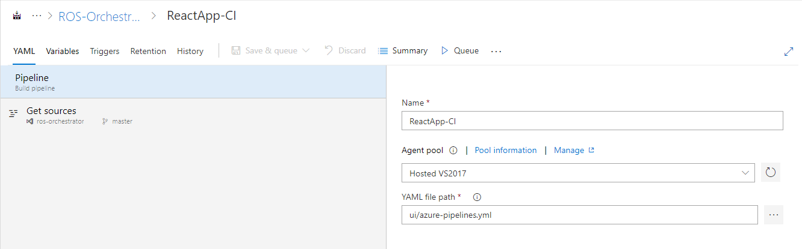
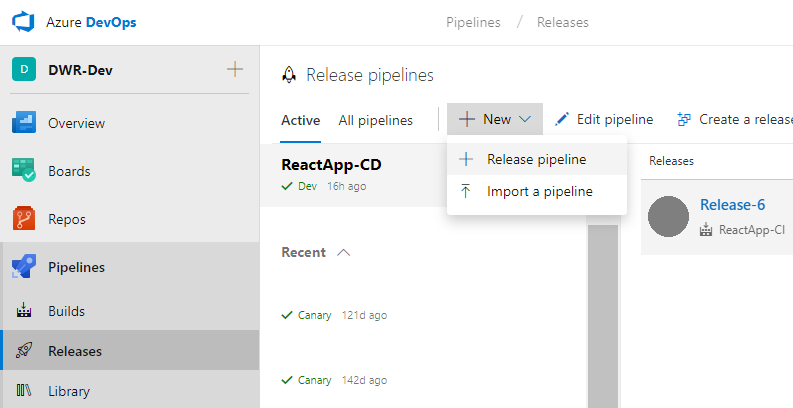
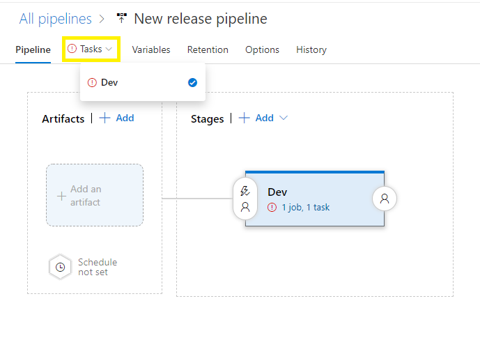
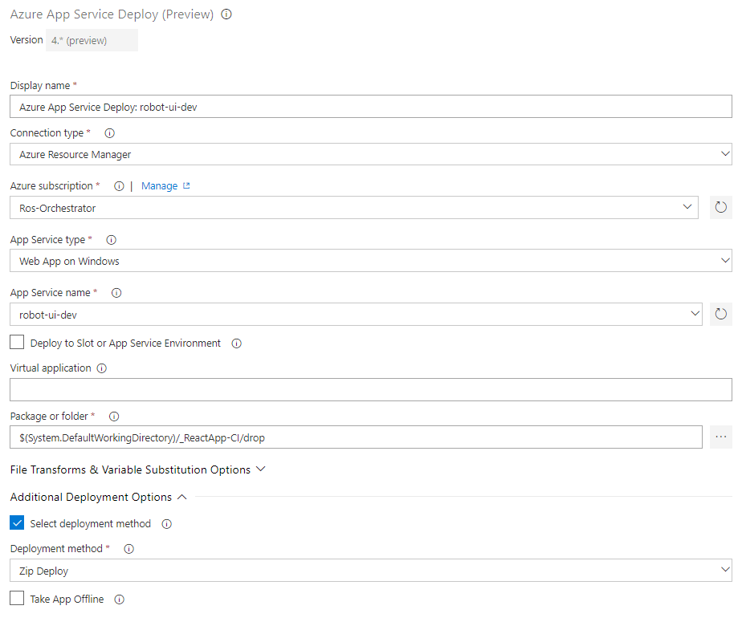
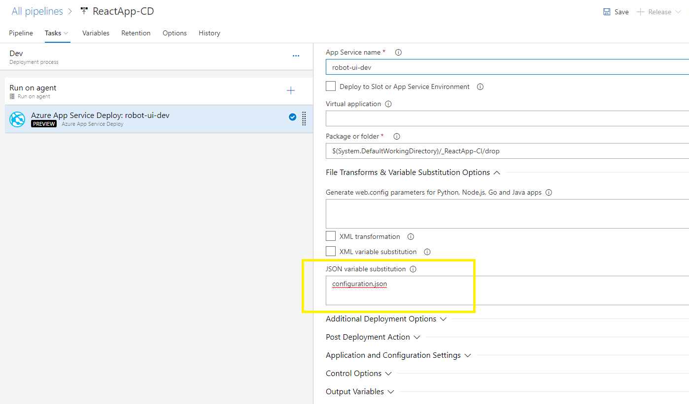
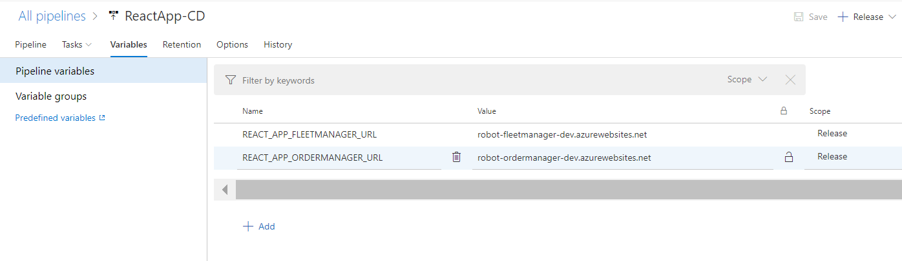

# Continuous Integration and Deployment

## Continuous Integration

The CI build pipelines are provided for the web apis and the UI in this project.

- [RobotOrchestrator.OrderProducer/azure-pipelines.yml](../RobotOrchestrator.OrderProducer/azure-pipelines.yml)
- [RobotOrchestrator.OrderManager/azure-pipelines.yml](../RobotOrchestrator.OrderManager/azure-pipelines.yml)
- [RobotOrchestrator.FleetManager/azure-pipelines.yml](../RobotOrchestrator.FleetManager/azure-pipelines.yml)
- [RobotOrchestrator.Dispatcher/azure-pipelines.yml](../RobotOrchestrator.Dispatcher/azure-pipelines.yml)
- [ui/azure-pipelines.yml](../ui/azure-pipelines.yml)

For more information on yaml builds, see [YAML Schema Reference](https://docs.microsoft.com/en-us/azure/devops/pipelines/yaml-schema?view=vsts). In the azure-pipelines.yml files for this project, the build will automatically be triggered by changes to the master branch.

For each of the APIs and UI projects, create a new Build Pipeline and reference the corresponding yaml file

## Continuous Deployment

In order to create the Continuous Deployment releases in Azure DevOps, use the Azure Web App Deploy Task for the Web APIs. See the official docs [here](https://docs.microsoft.com/en-us/azure/devops/pipelines/apps/cd/deploy-webdeploy-webapps?view=vsts).

- Create a New Pipeline.

- Select "Azure App Service Deployment" template, and name stage (i.e. 'Dev')
- Open 'Tasks', and fill out required fields. Select your Azure Subscription, and the name of the App Service you want to deploy the app to.

- Edit the fields in the "Deploy Azure App Service" task as shown. Be sure to select the Package from your CI build.

- Save and Queue your Release. It will automatically pick up the latest _ReactApp-CI artifact. To test a release for a specific artifact, find the specific build in your CI History, and click 'Release'.
- Repeat these steps for all Web APIs (OrderProducer, OrderManager, FleetManager, and Dispatcher)

### React App Specific Steps

- Follow the steps above for the react app deployment, with the following steps as well
- Edit the Azure App Service Deploy task for variable substitution in the file configuration.json. This will replace the variables in the json file with the variables in the next step during deployment

- Add variables to the release as shown below to point at your APIs

