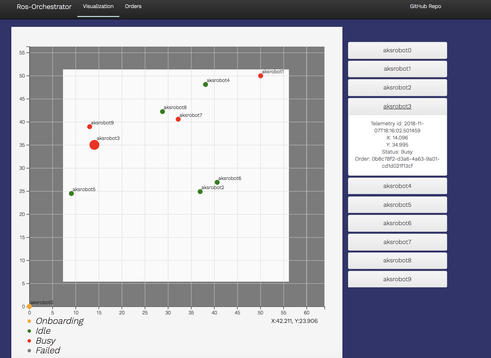

# Robot Orchestrator

This project provides a sample robot orchestrator that can run in the cloud.

For more information, see the following docs:

- [Architecture](./Docs/Architecture.md)
- [Install Requirements](./Docs/InstallRequirements.md)
- [Provisioning](./Docs/Provisioning.md)
- [Deploy Robot And Simulator](./Docs/DeployRobotAndSimulator.md)
- [CI/CD](./Docs/CICD.md)
- [Run Locally](./Docs/RunLocally.md)
- [Send Test Orders](./Docs/SendTestOrders.md)
